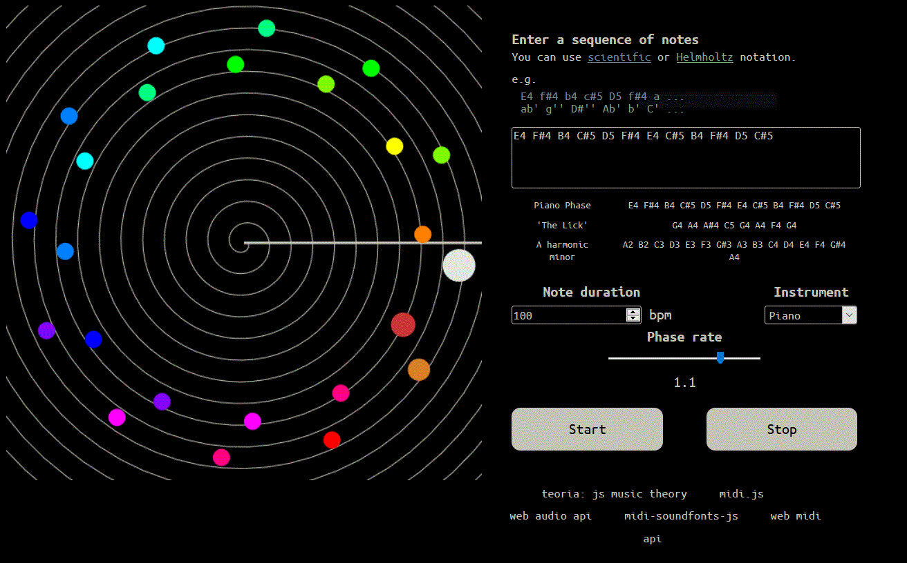

# Steve Reich Simulator: Piano Phase

## Overview

This web page allows users to simulate Steve Reich's composition *Piano Phase* both visually and auditorily. The page uses the [Web Audio API](https://developer.mozilla.org/en-US/docs/Web/API/Web_Audio_API) and some other cool modern browser features.

## Background

*Piano Phase* is a piece of music composed by the legendary Steve Reich in 1967. It is one of Reich's first applications of his "[phasing](https://en.wikipedia.org/wiki/Phase_music)" technique, which can also be heard elsewhere in his work (notably *Come Out* and *It's Gonna Rain*).

From [Wikipedia](https://en.wikipedia.org/wiki/Piano_Phase):

> Reich's phasing works generally have two identical lines of music, which begin by playing synchronously, but slowly become out of phase with one another when one of them slightly speeds up. In Piano Phase, Reich subdivides the work (in 32 measures) into three sections, with each section taking the same basic pattern, played rapidly by both pianists.

I find Steve Reich's phasing work fascinating and mesmerizing. Listening to any of these pieces is like having an auditory hallucination of [Borges's *Library of Babel*](https://en.wikipedia.org/wiki/The_Library_of_Babel): the phasing opens up an infinite sonic space where countless combinations and permutations of sounds are realized. Melodies and rhythms form like clouds and seamlessly recombine, or else evaporate into atmosphere.

## The Simulator

### Controls

By default the simulator is programmed to use Steve Reich's 12-note sequence from *Piano Phase*, but users can change the note sequence by typing in their own notes and melodies. There are a number of different instruments that can be chosen for playback. Users can change the tempo as well as alter the phase rate of the two voices. 

### The Visualization

Each of the two voices is visualized as a sequence of colored circles (each circle representing one note) revolving around a radius. The visualization is perhaps best understood as a dance (click the image below for a video!):

